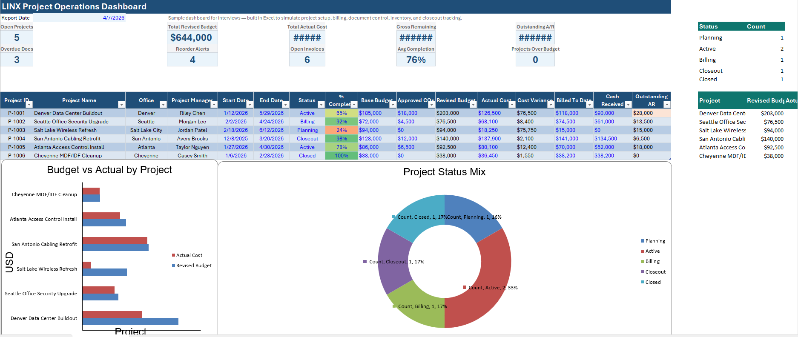
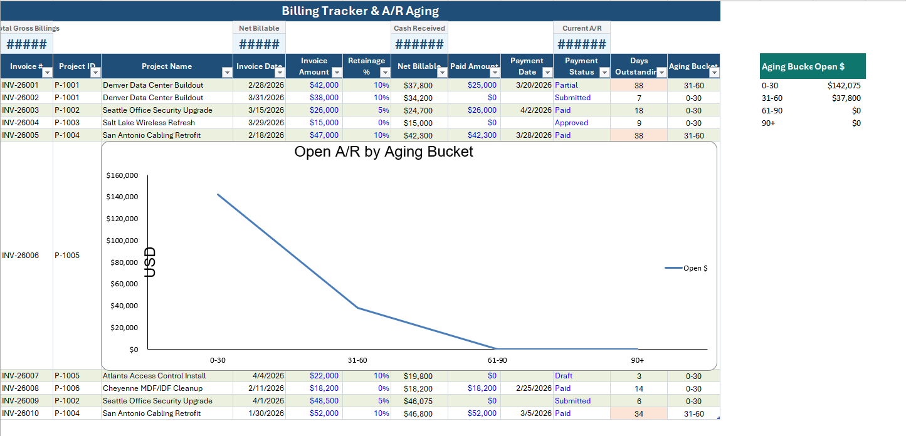
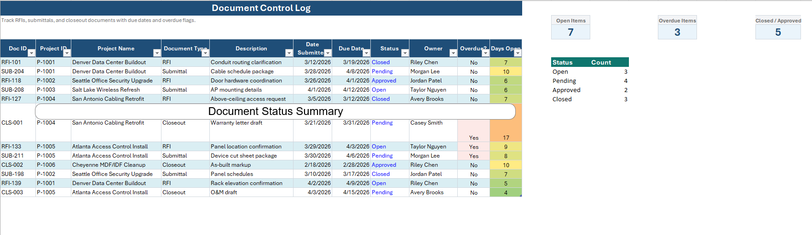
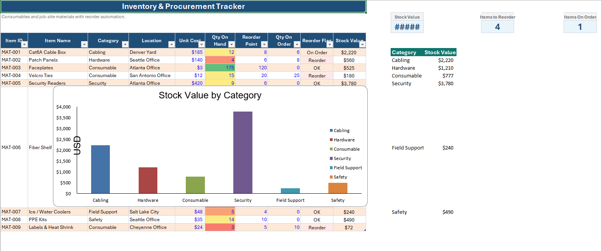
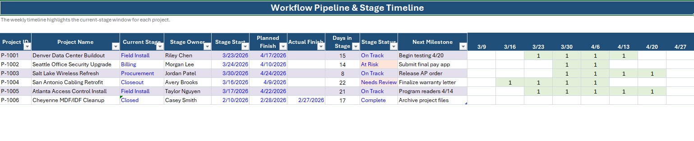

# Project Operations Dashboard (Excel)

A professional-grade Excel dashboard simulating real-world project coordination, the administrative, billing, documentation, inventory, and workflow support responsibilities commonly found in commercial construction and low-voltage/network infrastructure environments.

## 🔗 Case Study
[View Case Study](Project_Operations_Case_Study_Premium.pdf)

## 📊 Dashboard File
[Download Excel Dashboard](project-operations-dashboard-excel.xlsx)

This project was created as a portfolio piece to demonstrate operational thinking, project coordination, Excel reporting, and workflow visibility in a role similar to an Administrative Assistant / Project Coordinator position.

---

## Project Purpose

The goal of this dashboard is to simulate how a project support professional can help keep multiple jobs organized from setup through closeout.

It focuses on:

- Project setup and job tracking
- Billing and invoice monitoring
- Document control for RFIs and submittals
- Inventory and consumables tracking
- Workflow stage visibility
- KPI reporting and project health monitoring

---

## Tools Used

- Microsoft Excel
- Excel formulas
- Data validation drop-downs
- Conditional formatting
- Charts and KPI visuals
- Structured multi-sheet reporting

---

## Workbook Structure

### 1. Project Dashboard
Main summary page showing project-level KPIs and high-level visibility into operational status.

**Includes:**
- Project ID
- Project name
- Assigned project manager
- Status
- Completion percentage
- Budget vs actual cost
- Cost variance
- Dashboard charts and summary metrics

---

### 2. Billing Tracker
Tracks invoices, payment status, change orders, and billing aging.

**Includes:**
- Invoice number
- Project ID
- Billing date
- Due date
- Amount billed
- Amount paid
- Accounts receivable balance
- Aging days
- Overdue flag
- Change order reference

---

### 3. Document Control
Tracks important project documentation such as RFIs and submittals.

**Includes:**
- Project ID
- Document type
- Document number
- Description
- Date submitted
- Status
- Responsible party
- Notes

---

### 4. Inventory Tracker
Tracks materials, consumables, and supply movement.

**Includes:**
- Item name
- Category
- Quantity on hand
- Reorder threshold
- Unit cost
- Stock value
- Status
- Low stock indicator

---

### 5. Workflow Pipeline
Shows project movement across major stages from setup to closeout.

**Includes:**
- Project ID
- Stage
- Owner
- Start date
- End date
- Duration
- Status
- Notes

---

### 6. Controls / Automation Support
Supports dropdowns, helper lists, and logic used throughout the workbook.

---

## Key Features

- Automated calculations for:
  - Cost variance
  - Revised budgets
  - Accounts receivable
  - Invoice aging
  - Stock value
  - Workflow timing

- Built-in automation using:
  - Data validation dropdowns
  - Conditional formatting alerts
  - KPI summaries
  - Highlighting for overdue or high-risk items

- Visual reporting:
  - Dashboard metrics
  - Billing charts
  - Inventory visuals
  - Document status reporting

---

## Business Value

This dashboard demonstrates how administrative and operations support can directly improve project execution by helping teams:

- Keep project records organized
- Track billing and reduce missed follow-up
- Monitor project cost performance
- Maintain documentation visibility
- Support field teams with updated information
- Reduce delays caused by missing files or supply shortages

---

## Example Use Case

This workbook is useful as a simulation of how an administrative assistant, project coordinator, or operations support specialist might support:

- Commercial cabling projects
- Data center installations
- Security and wireless deployments
- Multi-site infrastructure jobs
- Construction-related project administration

---

## What This Project Demonstrates

This project highlights my ability to:

- Translate job requirements into a working operational tool
- Design structured reporting systems
- Support project coordination through data visibility
- Build Excel tools that simulate real business processes
- Connect administrative work with measurable project outcomes

---

## Portfolio Context

This project was built as part of my professional portfolio to demonstrate readiness for roles involving:

- Project coordination
- Administrative operations
- Billing support
- Documentation management
- Excel-based reporting
- Technical operations support

---

## Possible Future Improvements

- Power BI dashboard version
- Procore-style interface mockup
- SharePoint document tracker simulation
- Automated PDF report export
- Task reminders and milestone alerts
- Budget forecasting sheet
- Labor allocation tracker

---

## Screenshots

### Dashboard Overview

### Billing Tracker

### Document Control

### Inventory Tracker

### Workflow Pipeline

---

## Author

**Eric Amoh Adjei**  
Atlanta, GA  
Data Science | Operations | Technical Project Support

GitHub: [(https://github.com/amoheric/)]  
LinkedIn: [(https://www.linkedin.com/in/amoheric/)]
